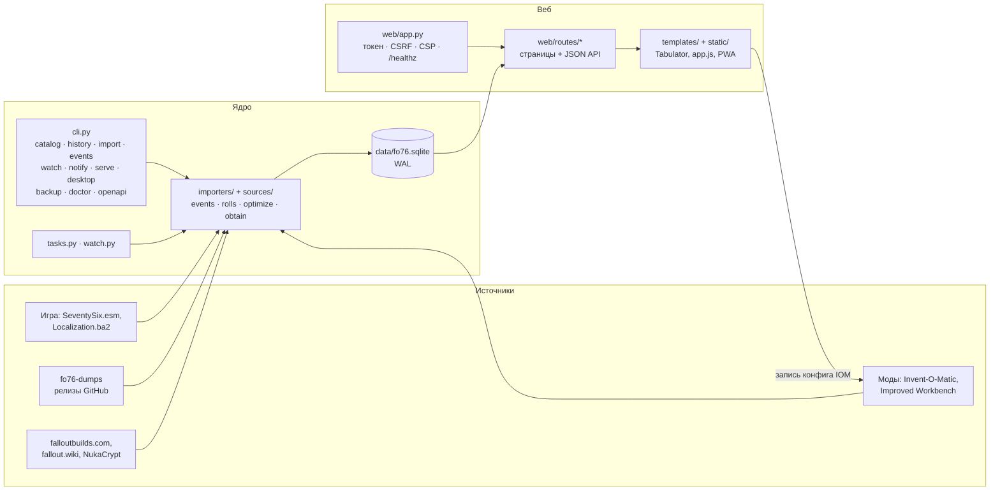

# Карта приложения

Одностраничная схема: что где лежит и как данные идут от источников до экрана. Подробности по модулям и таблицам — в [architecture.md](architecture.md), по источникам — в [data.md](data.md), по страницам — в [user-guide.md](user-guide.md).

## Слои

Единственная запись в файлы игры — редактор IOM (`iomconfig.py`, по подтверждению и с бэкапом). Всё остальное только читает игру и пишет в `data/`.

## Страницы

| Раздел | URL | Шаблон | Маршруты | Что делает |
|---|---|---|---|---|
| Главная | `/home` | `home.html` | `routes/inventory.py` | карточки персонажей, мастер первого запуска, блок «Данные» (запуск задач) |
| События | `/events` | `events.html` | `routes/events.py` | сброс дня/недели, сезон, Daily Ops, ежедневки, Минерва, календарь |
| Обновления | `/updates` | `updates.html` | `routes/items.py` | что появилось в каждом обновлении, изученные схемы |
| Инвентарь | `/inventory` | `inventory.html` | `routes/inventory.py` | «где лежит?», теги, свои имена |
| Вес | `/optimize` | `optimize.html` | `routes/plans.py` | куда уходит вес и что убрать |
| Роллы | `/rolls` | `rolls.html` | `routes/plans.py` | нужные роллы легендарок, уведомления |
| IOM | `/iom` | `iom.html` | `routes/settings.py` | редактор правил Invent-O-Matic |
| Каталог | `/` | `catalog.html` | `routes/items.py` | все предметы игры, фильтры, «изучено» |
| Карточка | `/item/<formid>` | `item.html` | `routes/items.py` | статы, крафт, «как получить», вики |
| Схемы | `/plans` | `plans.html` | `routes/plans.py` | изученные схемы, «передать и продать» |
| Легендарные моды | `/legendary` | `legendary.html` | `routes/plans.py` | матрица модов по персонажам |
| История | `/history` | `history.html` | `routes/inventory.py` | снимки выгрузок, сравнение |
| Настройки | `/settings` | `settings.html` | `routes/settings.py` | пути, сеть, моды, диагностика, копия базы, журнал, профили, теги |
| Глоссарий | `/glossary` | `glossary.html` | `routes/items.py` | термины |
| Вход | `/login` | встроен в `app.py` | `web/app.py` | вход по токену (только не с этого компьютера) |

Каркас всех страниц — `base.html` (меню, выбор персонажа, подвал). Общее для маршрутов — `web/common.py`. Полный список JSON-эндпоинтов — [api.md](api.md) и `openapi.json`.

## Откуда берутся данные

| Данные | Источник | Как попадают | Таблицы |
|---|---|---|---|
| Предметы, названия EN/RU | `SeventySix.esm`, `SeventySix - Localization.ba2` | `fo76db catalog` / «Каталог» | `items` |
| Статы, крафт, разбор, списки добычи, места | fo76-dumps (последний релиз) | `catalog` | `recipes`, `lvli`, `lvli_edges`, `placements` |
| «Добавлено в обновлении» | все стабильные релизы fo76-dumps | `history` / «История» | `builds`, `items.added_build` |
| Инвентарь, тайник, персонажи | `itemsmod.json` (Invent-O-Matic Extract) | `import` или `watch` | `characters`, `inv_snapshots`, `inv_items` |
| Легендарные моды | `LegendaryMods.ini` (Improved Workbench) | `import` или `watch` | `known_legendary_mods` |
| События, Минерва, сезоны, Daily Ops | falloutbuilds.com, fallout.wiki | `events` / `watch` раз в 6 ч | `events`, `minerva_plans` |
| Коды ракет | NukaCrypt | запрос при показе | не хранятся |
| Теги, вишлист, роллы, «изучено», ежедневки, поиски, подписи | вводятся пользователем | веб-интерфейс | `tags`, `item_tags`, `wishlist`, `leg_wants`, `known_recipes`, `daily_tasks`, `daily_done`, `saved_searches`, `profiles`, `display_names`, `account_labels` |

## Где что лежит на диске

| Что | Путь |
|---|---|
| База | `data/fo76.sqlite` (из исходников — в репозитории; в сборках — `~/.local/share/fo76db` или `%LOCALAPPDATA%\fo76db`) |
| Копии базы | `data/db-backups/` |
| Скачанные релизы dumps | `data/cache/` |
| Журнал | `data/app.log` |
| Пути и доступ по сети | `data/paths.json`, `data/network.json` |
| Настройки | `config.toml` (образец — `config.toml.example`) |
| Бэкапы конфига IOM | `<backup_root>/_backup_<ГГГГММДД>/` |

## Исходный код

| Папка / файл | Роль |
|---|---|
| `fo76db/cli.py`, `__main__.py` | команды |
| `fo76db/config.py`, `gamepaths.py`, `mods.py` | настройки, поиск игры, проверка модов |
| `fo76db/db.py` | схема, миграции, соединения |
| `fo76db/sources/` | чтение ESM/строк, fo76-dumps, вики, календарь, сеть |
| `fo76db/importers/` | сборка каталога, истории, импорт инвентаря |
| `fo76db/events.py`, `rolls.py`, `optimize.py`, `obtain.py`, `autotags.py`, `legendary.py`, `plantransfer.py` | прикладная логика страниц |
| `fo76db/tasks.py`, `watch.py`, `notify.py` | фоновые задачи, слежение, уведомления |
| `fo76db/iomconfig.py` | единственная запись в файлы игры |
| `fo76db/maintenance.py`, `applog.py`, `filepick.py` | копия базы, диагностика, журнал, окно выбора пути |
| `fo76db/desktop.py` | окно (Qt / WebView2) |
| `fo76db/web/` | FastAPI: `app.py`, `common.py`, `routes/`, `templates/`, `static/` |
| `packaging/`, `Dockerfile`, `.github/workflows/` | сборки и CI |
| `tests/` | pytest |
